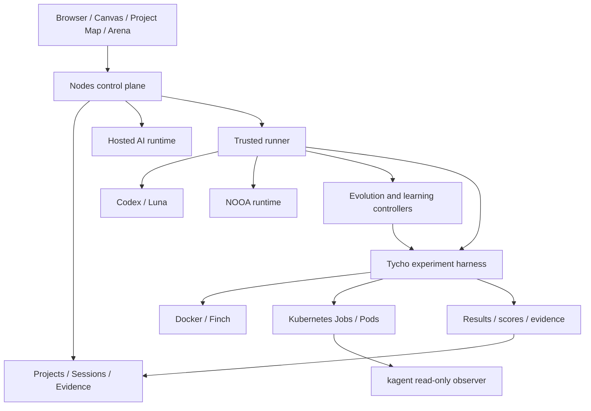

<p align="center">
  
</p>

<h1 align="center">Nodes</h1>

<p align="center">
  <strong>Explore every direction. Keep the decision.</strong>
</p>

<p align="center">
  A visual AI decision workspace for branching, evidence, comparison, and reusable project context.
</p>

<p align="center">
  <a href="https://github.com/Daedu86/Nodes-AI-Canvas/actions/workflows/ci.yml"></a>
  <a href="https://github.com/Daedu86/Nodes-AI-Canvas/actions/workflows/codeql.yml"></a>
  <a href="LICENSE"></a>
  
</p>

<p align="center">
  <a href="docs/product-demo.md"><strong>60-second demo</strong></a>
  ·
  <a href="docs/system-architecture.md"><strong>System architecture</strong></a>
  ·
  <a href="docs/nodes-cli.md"><strong>Nodes CLI</strong></a>
  ·
  <a href="ROADMAP.md"><strong>Roadmap</strong></a>
</p>

<p align="center">
  
</p>

Most AI tools optimize for one conversation. Nodes optimizes for the decision that has to survive after the conversation.

Instead of losing alternatives, evidence, experiments, and selected outcomes in scrollback, Nodes keeps them connected in a project workspace where teams can branch, compare, promote, and reuse the strongest result.

## The core workflow

```text
Question
  -> explore branches
  -> preserve evidence on Canvas
  -> compare alternatives in Arena
  -> select a winner
  -> promote the result into project context
  -> reuse it in later work
```

That loop is the product. Execution runtimes, experiments, agents, and learning capabilities extend it without replacing it.

## Why Nodes instead of another chat interface?

| Linear AI chat | Nodes |
| --- | --- |
| Alternatives drift into separate chats or disappear in history. | Branches stay attached to the decision they explore. |
| Important evidence is buried in transcripts. | Evidence, plans, code, files, prompts, and decisions are first-class Canvas artifacts. |
| Comparing answers is informal and easy to forget. | Arena makes comparison and winner selection explicit. |
| A good answer often dies with the conversation. | Selected outcomes can be promoted into durable project memory and downstream workloads. |
| Execution details are mixed into the UI boundary. | The browser remains a control plane while trusted runtimes own execution. |

## Product model

The **Project Map is the canonical project index and workload DAG**. A map node is a thinking/workload unit that can own one or more sessions, consume selected upstream outputs, execute work through a trusted runtime, and publish evidence downstream.

```text
Project
└── Project Map
    └── Node / workload
        ├── sessions
        ├── authorized inputs
        ├── evidence
        └── selected outputs
```

This keeps orchestration, provenance, and decision state visible while execution remains outside the browser.

## What you can do today

- Branch conversations without losing earlier paths.
- Preserve evidence, decisions, plans, code, files, images, and prompts on a persistent Canvas.
- Group sessions into projects and compose selected context across workloads.
- Compare branches or sessions in Arena and promote explicit winners.
- Carry promoted outcomes into project memory and later sessions.
- Execute project workloads through a trusted Codex runner.
- Use Tycho as an isolated empirical experiment and evidence harness.
- Place evolution candidates locally or in Kubernetes Jobs.
- Inspect Kubernetes execution with a read-only kagent observer.
- Inspect project, session, runner, and Tycho state with the read-only `nodes` CLI.

## Run the deterministic demo

The repository includes a seeded product tour that does not depend on waiting for a live model response.

```bash
npm ci
cp .env.example .env.local
npm run demo:seed
npm run dev
```

On Windows PowerShell:

```powershell
Copy-Item .env.example .env.local
```

Set the local development credentials described in [docs/product-demo.md](docs/product-demo.md), sign in, and open **[Demo] Nodes product launch**.

The recommended 60-second path is:

1. branch two positioning directions;
2. preserve evidence and the chosen direction on Canvas;
3. compare alternatives in Arena;
4. promote the winner;
5. reuse that decision from project memory or Context Builder.

See [docs/product-demo.md](docs/product-demo.md) for the complete presentation script and reset commands.

## Architecture at a glance



The browser is the **control plane**, not the execution boundary. Runtime placement and local workspace resolution remain runner responsibilities. Kubernetes is the scheduling authority for cluster candidates; kagent observes the cluster but is not inserted into deterministic scheduling or promotion.

See [docs/system-architecture.md](docs/system-architecture.md) for the canonical whole-system architecture.

## Advanced execution and learning

Nodes also contains an optional M1–M8 capability stack for adaptive execution. These are **capabilities, not mandatory sequential stages** and they are intentionally secondary to the core decision workflow.

| Capability | Purpose |
| --- | --- |
| **M1 — Evolution** | Candidate populations, deterministic evaluation, durable episodes, lineage, and champions. |
| **M2 — Kubernetes** | Isolated candidate Jobs plus read-only kagent diagnostics. |
| **M3 — Learned policy** | Trajectory/reward storage and learned strategy selection. |
| **M4 — Multi-agent** | Hierarchical specialist/team coordination. |
| **M5 — Skill learning** | Mine, validate, store, retrieve, and reuse skills. |
| **M6 — Curriculum** | Select or generate tasks from learning progress and capability gaps. |
| **M7 — World model** | Predict transitions and outcomes before expensive execution. |
| **M8 — Planning** | Search predicted futures and choose promising actions before execution. |

A workload may use direct execution only, M1+M2, or a richer combination. Learned components can choose what to try; empirical execution and evidence remain the promotion gate.

## Developer quick start

Requirements:

- Node.js 22
- npm
- OpenRouter credentials for live hosted inference, or the seeded demo for a no-inference tour

```bash
npm ci
cp .env.example .env.local
npm run dev
```

Then open `http://localhost:3000`.

For full setup and validation commands, see [docs/development.md](docs/development.md). For production configuration, see [docs/deploying.md](docs/deploying.md) and [docs/cloud-persistence.md](docs/cloud-persistence.md).

## Quality gates

The main CI workflow covers formatting/lint, application and E2E type checks, unit and coverage gates, production build and bundle budget, accessibility E2E in Chromium and Firefox, dependency auditing, Canvas performance budgets, and sharded Playwright E2E.

The repository also includes CodeQL scanning and a public [security policy](SECURITY.md).

## Nodes CLI

The repository includes a read-only CLI over the same project/session repositories and runner-readiness service used by the application.

```bash
NODES_CLI_USER_ID='dev:demo@nodes.local' npm run nodes -- project list
NODES_CLI_USER_ID='dev:demo@nodes.local' npm run nodes -- project diagnose <project-id> --json
```

The CLI can inspect projects, workloads, sessions, runner readiness, and Tycho provenance; it does not start Codex or execute experiments. See [docs/nodes-cli.md](docs/nodes-cli.md).

## Architecture documents

- [Whole-system architecture](docs/system-architecture.md)
- [Project Map architecture](docs/project-map-architecture.md)
- [Agent runtime architecture](docs/agent-runtime-architecture.md)
- [M2 — Kubernetes/kagent evolution](docs/m2-kagent-kubernetes-evolution.md)
- [M3 — learning controller](docs/m3-learning-controller.md)
- [M4 — hierarchical multi-agent](docs/m4-hierarchical-multi-agent.md)
- [M5 — autonomous skill learning](docs/m5-autonomous-skill-learning.md)
- [M6 — autonomous curriculum](docs/m6-autonomous-curriculum.md)
- [M7 — predictive world model](docs/m7-predictive-world-model.md)
- [M8 — model-based planning](docs/m8-model-based-planning.md)

## Persistence and deployment

Nodes uses repository abstractions so local development can use the file backend while production can use Supabase Postgres and Storage. The reference web deployment is Vercel; trusted local/cluster execution remains a separate execution plane.

## Project status

Nodes is under active development toward a stable `1.0`. Interfaces, persistence details, and operational defaults may evolve.

Current product-readiness priorities are tracked in the [roadmap](ROADMAP.md), including a stable public demo experience, expanded onboarding, starter projects, responsive improvements, and additional manual accessibility review.

- [Roadmap](ROADMAP.md)
- [Contributing](CONTRIBUTING.md)
- [Security policy](SECURITY.md)

## License

MIT. See [LICENSE](LICENSE) and [THIRD_PARTY_NOTICES.md](THIRD_PARTY_NOTICES.md).
