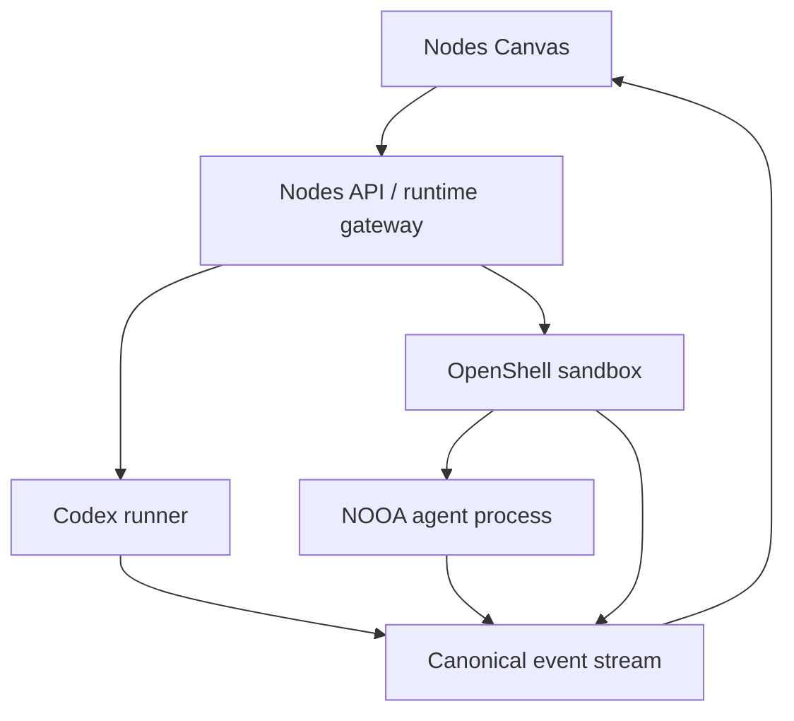

# Agent runtime architecture

Nodes is evolving from a Canvas that visualizes one local Codex runner into a
provider-neutral agent workspace. This document defines the stable boundaries
for that evolution across Nodes, NVIDIA OO Agents (NOOA), and OpenShell.

The shared contracts live in `lib/agents/runtime/`. The local NOOA integration
now lives at `services/nooa-runner/`: it starts an ephemeral OpenShell sandbox,
runs a NOOA worker inside it, and exposes a private HTTP/SSE bridge to Nodes.
It does not yet change the existing Codex Canvas UI into a runtime picker.

## Roles and trust boundaries



| Component | Responsibility | Must not do |
| --- | --- | --- |
| Nodes | Owns the Canvas, session/project authorization, node compilation, event rendering, and durable UI state. | Execute generated code inside the browser or resolve arbitrary filesystem paths from a client request. |
| NOOA | Runs object-oriented agent methods, exposes its event model, and exports traces. | Act as the operating-system containment boundary. |
| OpenShell | Creates the sandbox, applies a declared policy, and controls filesystem, network, process, and inference boundaries. | Trust a browser-provided policy document or workspace path. |
| Runtime gateway | Resolves trusted runtime configuration, starts/cancels runs, translates provider events, and streams canonical events. | Let a provider-specific payload become a Canvas contract. |

NOOA's in-process checks remain useful defense in depth, but an agent that can
execute generated Python must run inside an OpenShell sandbox (or an equivalent
OS-level containment boundary). A NOOA node therefore requires an OpenShell
policy reference at compilation time.

## Common node model and compiler

`AgentRuntimeNode` is the Canvas-level definition of an executable node. The
compiler in `lib/agents/runtime/compiler.ts` converts it into a deterministic
`CompiledAgentRun`:

- It validates the Canvas node id, owning session, prompt, and role.
- It trims and normalizes data without allocating a provider run id.
- It requires `sandbox.provider = "openshell"` and a server-resolved `policyId`
  whenever a runtime requires OpenShell.
- It deliberately does not inspect local files, start a process, or accept raw
  policy YAML from the browser.

The compiler is deterministic so a route can validate a node before starting a
provider, and tests can compare the plan exactly. Provider adapters own all
side effects after compilation.

The initial catalog contains two entries:

| Runtime | Status | Current integration point |
| --- | --- | --- |
| Codex | Enabled | Existing `services/codex-runner`; a common-envelope adapter is ready for its Canvas events. |
| NOOA | Enabled locally | `services/nooa-runner` resolves trusted policy/workspace ids, launches NOOA in an ephemeral OpenShell sandbox, and streams normalized events. |

## Event contract

Every event sent to Canvas has a provider-neutral envelope:

```ts
{
  id: string;
  runId: string;
  nodeId: string;
  runtime: "codex" | "nooa";
  type: "agent.started" | "tool.completed" | "run.completed" | "...";
  source: "compiler" | "runtime" | "sandbox";
  sequence: number;
  createdAt: string;
  parentRunId: string | null;
  payload: Record<string, unknown>;
}
```

`sequence` is monotonic within a run and supports reconnecting an SSE consumer
after a known cursor. The in-process bus holds a bounded backlog of 500 events
per run by default; the runtime gateway will mirror those envelopes into Nodes'
existing durable event persistence before a run is treated as recoverable.

Provider details remain in `payload`. For example, the first Codex adapter
preserves the existing `method` and `params` fields while translating its event
type into the canonical vocabulary. The local NOOA runner maps task, LLM,
tool, Python-output, trace, and terminal worker messages without requiring
Canvas to understand NOOA-specific class names.

## Runtime API target

The TypeScript contract defines a small control-plane interface:

- `start({ ownerId, run })` returns a runtime-neutral run id and status.
- Optional `cancel` and `resolveApproval` operations keep approval handling
  provider-specific but consistently authorized by Nodes.
- Runners emit canonical events through the shared bus and an SSE transport.

The implemented NOOA bridge is intentionally narrow:

- Nodes exposes `/api/agents/nooa/runs`, run-event SSE, and cancellation.
- The local runner exposes `/v1/runs`, event SSE, cancellation, health, and
  readiness checks on a loopback/private endpoint.
- Requests carry only a compiled node, `workspaceId`, and `policyId`.
- The runner resolves the workspace path, policy YAML, sandbox image,
  OpenShell providers, and model configuration from runner-owned environment
  variables.

The workspace is uploaded as a sandbox snapshot. This phase never copies a
sandbox edit back to the host automatically; a future review/apply flow will
make write-back an explicit human action.

## Incremental delivery

1. **Runtime foundation:** contracts, compiler, event bus, Codex
   event adapter, and unit tests.
2. **NOOA gateway (this change):** a private service with trusted runtime
   configuration; it starts NOOA inside a named OpenShell policy and exports
   canonical events through Nodes routes.
3. **Canvas integration:** selectable runtime nodes, run controls, policy-aware
   validation messages, and one shared event rendering path.
4. **Durability and operations:** persist canonical events, resume streams,
   surface OpenShell policy decisions and NOOA traces, and add end-to-end
   coverage against a real sandbox.

The OpenShell and NOOA repositories do not need source changes for step 1. The
integration is intentionally service-boundary based so their upstream update
paths remain intact and Nodes owns only its adapter code.
