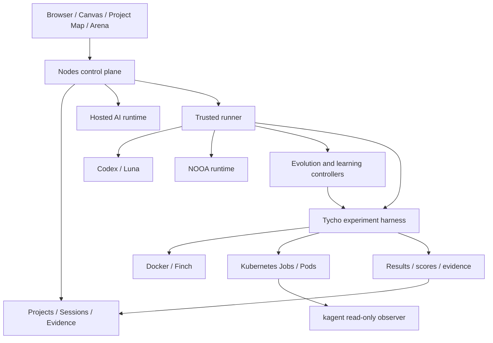

# Nodes system architecture

This is the canonical whole-system architecture for Nodes.

## Core model

Nodes is a control plane for AI work. The Project Map is the canonical workload DAG and index.

```text
Project
└── Project Map
    └── Node (thinking/workload unit)
        ├── Sessions
        ├── authorized inputs
        ├── evidence
        └── selected outputs
```

## System boundary



The browser is a control plane, not the execution boundary. Runtime placement, local workspace resolution and experiment isolation remain server/runner responsibilities.

## Responsibility split

### Nodes control plane

Nodes owns project/workload/session identity, the Project Map, authorization, Canvas/Arena state, durable evidence, capability selection and orchestration requests.

### Trusted runner

The runner owns local execution context, logical workspace mappings, Codex lifecycle, event streaming, cancellation, Tycho listeners and the evolution controllers. Workloads use server-authoritative materialized session inputs and selected upstream outputs.

### Tycho

Tycho is the empirical execution and evidence boundary. It executes declared experiments in an isolated runtime and returns structured results. Local placement uses Docker/Finch; M2 can place candidates in Kubernetes Pods.

### Kubernetes and kagent

Kubernetes is the scheduling/execution authority for cluster candidates. kagent is intentionally read-only: it observes Jobs, Pods, events and logs for diagnostics and does not become the deterministic scheduler or promotion authority.

## M1-M8 capability stack

M1-M8 are capabilities/layers, not mandatory sequential stages for every project.

| Capability | Responsibility |
| --- | --- |
| M1 — Evolution | Candidate populations, deterministic winner selection, durable episodes and provenance. |
| M2 — Kubernetes execution | Hardened candidate Jobs plus read-only kagent diagnostics. |
| M3 — Learned policy | Trajectories, rewards and learned strategy/action selection. |
| M4 — Hierarchical multi-agent | Specialized agents and team-level coordination. |
| M5 — Skill learning | Mine, validate, register, retrieve and reuse learned skills. |
| M6 — Autonomous curriculum | Choose or generate tasks from capability gaps and learning progress. |
| M7 — Predictive world model | Predict candidate outcomes/transitions before expensive execution. |
| M8 — Model-based planning | Search predicted futures and select promising plans before execution. |

```text
workload state
  -> capability / policy selection
  -> candidate generation
  -> prediction / planning (optional)
  -> Tycho execution
  -> structured evidence + deterministic evaluation
  -> learning updates (optional)
  -> durable Session / Project evidence
```

Learned components influence which action to try; they do not replace the authoritative execution/evidence gate.

## Evidence and recovery

Long-running evolution checkpoints committed generations and retains lineage, evaluations, winners and champion state. Ordinary Codex runs can reconstruct missing Canvas run nodes from persisted run-start events. Workload prompts remain scoped to server-selected inputs.

Tycho protocol recovery is fail-closed: Nodes may restore a previously preserved `.nodes/tycho-experiment.json` when one unique authoritative protocol exists; it does not synthesize a replacement during recovery and rejects conflicting preserved protocols.

## Detailed documents

- [Project Map architecture](project-map-architecture.md)
- [Agent runtime architecture](agent-runtime-architecture.md)
- [Nodes CLI](nodes-cli.md)
- [M2 — kagent + Kubernetes](m2-kagent-kubernetes-evolution.md)
- [M3 — learning controller](m3-learning-controller.md)
- [M4 — hierarchical multi-agent](m4-hierarchical-multi-agent.md)
- [M5 — autonomous skill learning](m5-autonomous-skill-learning.md)
- [M6 — autonomous curriculum](m6-autonomous-curriculum.md)
- [M7 — predictive world model](m7-predictive-world-model.md)
- [M8 — model-based planning](m8-model-based-planning.md)
